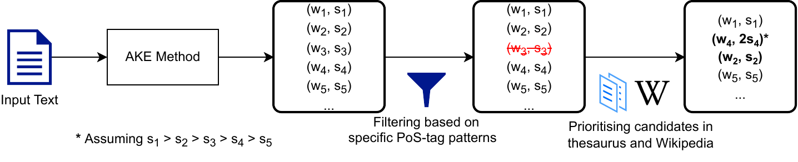

# Improving Performance of Automatic Keyword Extraction (AKE) Methods Using PoS Tagging and Enhanced Semantic-Awareness

This repository includes the source codes presented in the paper titled *"Improving Performance of Automatic Keyword Extraction (AKE) Methods Using PoS Tagging and Enhanced Semantic-Awareness"* accepted for the special issue of [*MDPI Information*](https://www.mdpi.com/journal/information), [*Information Extraction and Language Discourse Processing*](https://www.mdpi.com/journal/information/special_issues/WYS02U2GTD).



The paper proposes a *simple* but *effective* post-processing-based universal approach to improving the performance of *any* AKE methods, via an enhanced level of semantic-awareness supported by PoS tagging. To demonstrate the performance of the proposed approach, we considered word types retrieved from a PoS tagging step and two representative sources of semantic information — specialised terms defined in one or more context-dependent thesauri, and named entities in Wikipedia. The above three steps can be simply added to the end of *any* AKE methods as part of a post-processor, which simply re-evaluates all candidate keywords following some *context-specific* and *semantic-aware* criteria.  For five state-of-the-art (SOTA) AKE methods, our experimental results with 17 selected datasets showed that the proposed approach improved their performances both *consistently* (up to 100% in terms of improved cases) and *significantly* (between 10.2% and 53.8%, with an average of 25.8%, in terms of F1-score and across all five methods), especially when all the three enhancement steps are used.

## Contact

If you have any questions about the source codes, please reach out to the first author via email: [Enes Altuncu](mailto:drenesaltuncu@gmail.com)

## Citation

Please cite our work as follows if you use our dataset or the provided source codes in your research:

````
@article{altuncu2025,
  title={Improving Performance of Automatic Keyword Extraction ({AKE}) Methods Using {PoS} Tagging and Enhanced Semantic-Awareness},
  authors={Altuncu, Enes and 
           Nurse, Jason R.~C. and 
           Xu, Yang and
           Guo, Jie and
           Li, Shujun},
  year={2025},
  numpages={23},
  journal={Information},
  publisher={MDPI},
}
````
